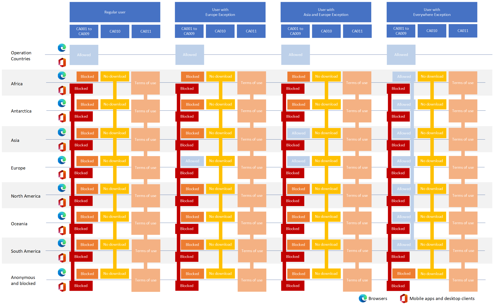
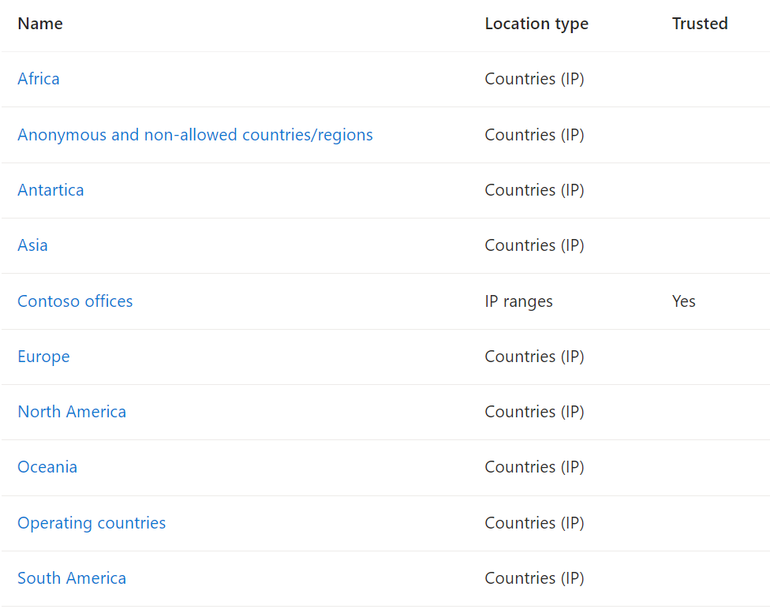
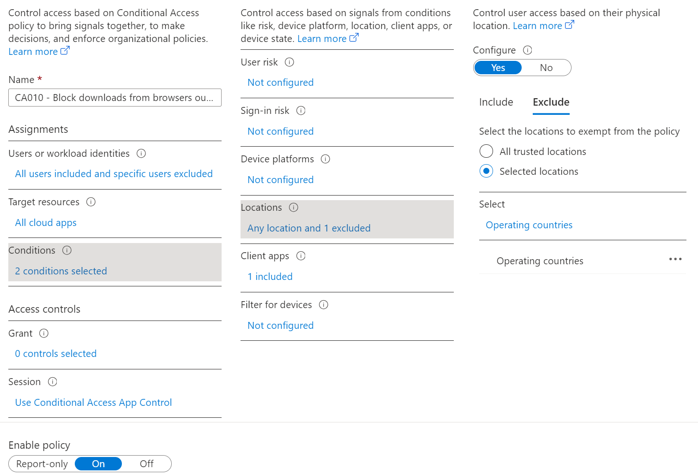
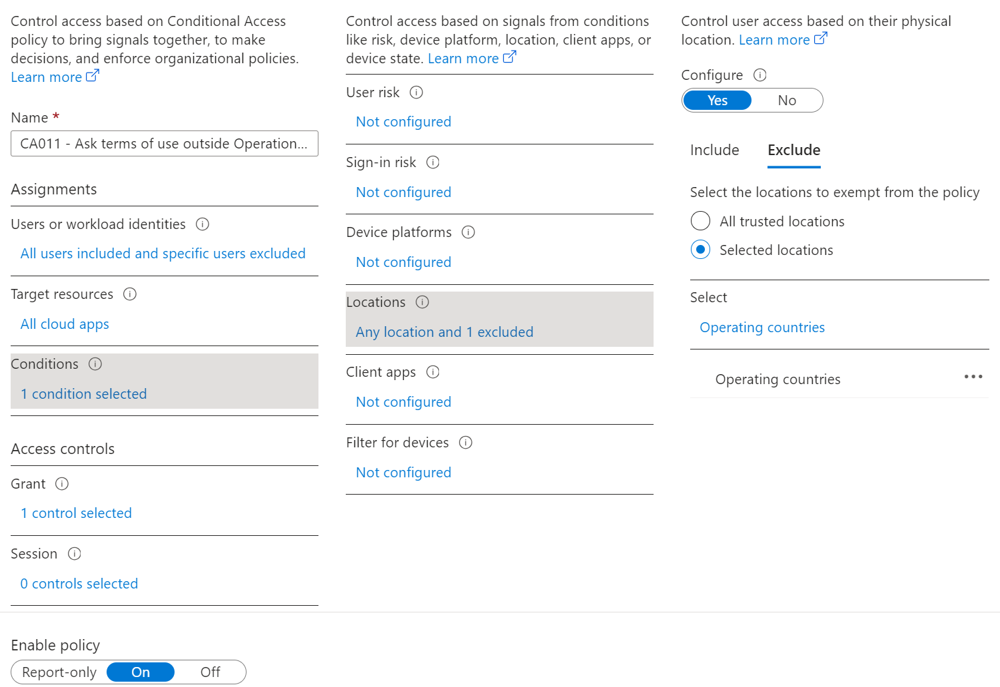
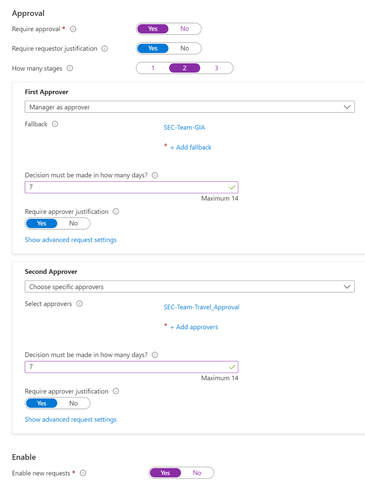

# Table of Contents
- [Introduction](#introduction)
- [Conditional Access](#conditional-access-configuration)
    - [Prerequisites](#prerequisites)
    - [Named Location](#named-locations)
    - [Exclusion Groups](#exclusion-groups)
    - [Terms of use](#terms-of-use)
    - [Conditional Access Policies](#conditional-access-policies)
- [Access Package](#access-package-configuration)
    - [Prerequisites](#prerequisites-1)
    - [Catalog](#catalog)
- [User Experience](#user-experience)
    - [User](#user)
    - [Manager](#manager)
    - [Approver](#approver)
- [Success and Errors](#success-and-errors)

# Introduction

We often get questions like *“How can I give access to travelers without opening access to everybody?”*, *“Can we stop our travelers from downloading files outside our countries of operation?”*, *“How can I ensure that my travelers know about our internal travel policies?”*, *“I don’t want to have a big impact on our helpdesk/identity management team, would there be a solution that reduces that impact?”* 

# Conditional Access Configuration

Let’s start with the question *“How can I give access to travelers without opening access to everybody?”*

An effective way to carry out that goal would be to create a Conditional Access Policy (CAP) that blocks sign-ins from anywhere except your operation countries and then use the exclusions on that CAP to allow people to sign-in from anywhere. 

This approach works quite well, but if we want to reduce the risk, would it not be better to give access to only the countries that they will visit? Yes, but if we want to create one policy per country, we will probably reach the maximum number of policies that a tenant can have (195 policies: [Plan an Azure Active Directory Conditional Access deployment - Microsoft Entra | Microsoft Learn](https://learn.microsoft.com/en-us/azure/active-directory/conditional-access/plan-conditional-access#minimize-the-number-of-conditional-access-policies)). Another limitation that we have is that some users don’t know exactly the list of countries that they will travel to (ex: the user plans to go to Belgium and Germany but have not planned that they will pass through France and that the flights taken will pass by the Netherlands). Instead of going with one CAP for each country we will solve those limitations by creating categories, each one with a different CAP: 
- Continents (Africa, Antarctica, Asia, Europe, North America, Oceania, South America) 
- Anonymous and blocked countries 

The next question that we will solve is *“Can we stop our travelers from downloading files outside our countries of operation?”* 

We can do it by blocking the possibility to use the Modern and Desktop apps while outside the operation countries but allowing access from browsers in a session that does not have the possibility to download files. We will have one CAP for each of those requirements. 

Note that a file already present on the user’s device will not be protected by this. The use of device encryption (ex: BitLocker) and DLP (ex: Azure Information Protection) is recommended.  

*“How do I ensure that my travelers know about our internal travel policies?”*, this question can be answered in many ways: 
- a member of the security team could send an email before the travel. 
- it could be part of the onboarding process for new employees. 
- etc. 

We want this step to be as easy as possible for everybody so we will create Terms of use that the user will need to read and accept the first time they sign-in outside the operation countries. 

 
This diagram shows 4 different cases as examples: 

- The first column shows a regular user without exclusions; in that case the user only has access from operation countries. 
- The second column shows a user with an exclusion, allowing them an access from Europe; in that case the user has the same access as the first column plus a web access without download from Europe, the user must agree to a term of use the first time that they will sign-in from outside an operation country. 
- The third column shows a user with two exclusions, allowing them an access from Europe and Asia; in that case the user has the same access as the first column plus a web access without download from Europe and Asia, the user must agree to a term of use the first time that they will sign-in from outside an operation country. 
- The last column shows a user with an exclusion, allowing them an access from anywhere except anonymous and blocked locations; in that case the user has the same access as the first column plus a web access without download from anywhere except anonymous and blocked locations, the user must agree to a term of use the first time that they will sign-in from outside an operation country. 

There are other CAPs that would be recommended (asking for MFA, blocking legacy authentications, blocking access to certain apps, checking device compliance, self-remediation or blocking on user and sign-in risks, etc.) but this blog won’t cover them. 

## Prerequisites

- The following roles for configuration: 
    - Conditional Access Administrator or Security Administrator (for Conditional Access, Named Location, Terms of use) 
    - And Groups Administrator or User Administrator (for Exclusion groups) 
    - Or Global Administrator 
- A Term of use must have been created and be available in PDF.
- Azure AD Premium P1 is needed for every user that will use the CAPs. 
- Microsoft Defender for Cloud Apps (included in EMS-E5) is needed for every user that will use the block download functionality. 

## Named Locations

1. We need to create the different Countries Location for every continent. 
    - You must ensure that a country is not part of two continents Locations. 
2. We create a new Countries Location for anonymous countries/regions. 
    - We need to check the “Include unknown countries/regions”. 
    - We also need to have at least one country selected. 
3. We need to create a Countries Location for our countries of operation. 

Example for Europe

     

Example of anonymous and non-allowed

     

Example of Operation countries

     

View of all locations created

     

## Exclusion groups
1. We will then create an exclusion group for every continent and for Everywhere.
    - The groups must be security groups.
    - The groups must be Assigned.
    - The groups should have an Owner.
    - The groups should not be “Azure AD roles can be assigned to the group”.
    - A good description should be considered.
    - No members should be added to the groups.
2. We must add the Everyone group as part of all the continent groups.
3. A group for Anonymous and blocked regions/countries can be added but is not recommended since no exclusions should be allowed.

Example of exclusion group for Europe

     

All exclusion groups

     

Membership of exclusion group for Everywhere

     

## Terms of use
1. Create a new Term of use.
2. Include all the languages that are needed.
3. Upload the PDF for all languages added.
4. Make sure that “Require users to expand the terms of use” is set to On.
5. Select the expiration policy settings that you want to use.
6. Select “Custom policy” since we will create the CAP later.

     

## Conditional Access Policies

1.	Create a CAP to block mobile apps and desktop clients outside Operation countries.
    - Users: All users – Break glass account should be excluded.
    - Cloud apps: All cloud apps.
    - Conditions, Locations: Any locations, with exclusions for Operation countries.
    - Conditions, Client apps: Mobile apps and desktop clients.
    - Grant: Block access.

     

     

2.	Create a CAP to block browser access from Anonymous and non-allowed countries/regions.
    - Users: All users – Break glass account should be excluded.
    - Cloud apps: All cloud apps.
    - OPTION 1 : Conditions, Locations: Anonymous and non-allowed countries/regions.
    - OPTION 2 : Conditions, Locations: Any locations, with exclusions for every continent and Operation countries.
    - Conditions, Client apps: Browser.
    - Grant: Block access.

Two different configurations are possible for the Locations condition of this CAP.
- OPTION 1 : Using Anonymous and non-allowed countries/regions Named Location.
    - Pro : You have a well-defined list of what you block.
    - Con : In the case of new countries/regions, it is allowed for browser access until you add it to the right Named Location.
- OPTION 2 : Using Any location except continents and operation countries.
    - Pro : In the case of new countries/regions, it is blocked until you assign it to the right Named Location.
    - Con : You must ensure that the countries you want to block are not present in any continents.

OPTION 1 :

     

OPTION 2 : 

     

     

3.	Create CAPs to block browser access from a continent.
    - Users: All users excluding exclusion group for the continent – Break glass account should be excluded.
    - Cloud apps: All cloud apps.
    - Conditions, Locations: continent location.
    - Conditions, Client apps: Browser.
    - Grant: Block access.

     

     

4.	Repeat previous step for each continent.

5.	Create a CAP to block download from browsers outside Operation countries.
    - Users: All users – Break glass account should be excluded.
    - Cloud apps: All cloud apps.
    - Conditions, Locations: Any locations, with exclusions for Operation countries.
    - Conditions, Client apps: Browser.
    - Session: User Conditional Access App Control, Block downloads (Preview).

     

     

6.	Create a CAP to ask for Terms of use outside Operation countries.
    - Users: All users – Break glass account should be excluded.
    - Cloud apps: All cloud apps.
    - Conditions, Locations: Any locations, with exclusions for Operation countries.
    - Conditions, Client apps: Browser.
    - Grant: Your terms of use for travelers.

     

     

Your Conditional Access policies should look like this:

     

# Access Package Configuration

Now that we have a fully functional way to manage the travelers, let’s look at this question “I don’t want to have a big impact on our helpdesk/identity management team, would there be a solution that reduces that impact?”.
The challenges that we have are:
- We need a way for people to tell us that they will travel.
- We need an approval process.
- We have exclusion groups, but we don’t want users to stay in them after they come back.
We will solve all those points with Entitlement management by automating the process. 
- The process will be started by the user.
- The approval will be a two-step approval with the people that need to be part of the decision, the user’s manager, and the security team.
- The user will be removed automatically from the group at the end of their trip.

## Prerequisites

- One of the following roles for configuration:
    - Identity Governance Administrator
    - Global Administrator
- Azure AD Premium P2 is needed for every user that will use the Access Packages.
- Exclusion groups must have been created and assigned to the CAPs.
- Users must have a manager assigned to them, if not a failover administrator will be used.

## Catalog

1. Create a new catalog that will be used to manage all exclusion groups that we created earlier

     

2. Open the new catalog and add all resources that will be available for this catalog.

     

3. Add all resources (groups, applications, SharePoint sites). In our scenario, we need to add all groups we created earlier.

     

4. Content of your catalog

     

## Access Package

### Creation
1. Create one package for each region in your catalog.

     

2. Define a name and a description; your users will see this information in “my access” portal.

     

3. Add the corresponding group from your catalog. You also need to define the role that the user will have. In this scenario we want them to have the role “Member”.

     

4. Requests
    - Define who can ask for this package:
        - Specific users and groups: use a group that holds all your users.
        - All members (excluding guests): all identities as “member” type.
        - All users (including guests): all identities (member and guest).
    - Define approval parameters in the same page.
        - Require requestor justification: strongly recommended.
    - How many stages: 2
        - First approver
            - Use the manager of the user (this attribute on user needs to be filled).
            - As fallback, you can set the GIA team.
            - You must set the number of days allowed to make the decision.
            - Require approver justification: for tracking; this parameter should be considered.
        - Second approver
            - Use specific approvers.
            - Set the travel approvers group.
            - You must set the number of days allowed to make the decision.
            - Require approver justification: for tracking; this parameter should be considered.
    - Enable new request: set to Yes.

     

     

5.	You can request some information for the requestor. That information will be seen during the approval process.

     

You can also add different languages as needed.

     

     

6.	Lifecycle
    - Expiration: define the number of days/hours or never.
    - Users can request a specific timeline: we recommend letting the user define their period.
    - Allow users to extend access: before the expiration, let users ask for an extension. If the user is traveling, it could be interesting to give them this opportunity.
    - Require approval to grant extension: same approval process as initial request.
    - Require access reviews: you can implement an access review but, in this case, it is not mandatory since an expiration is defined*.
    * If you don’t implement an expiration period, we strongly recommend enabling and defining an Access Review to be sure users and/or groups still need access.

     

7.	Custom extensions
This section is not needed in this scenario but could help to automate some activities. We plan to elaborate on the possibilities offered in the future.

     

8.	Review + create.
Review and confirm all your parameters and then create.

     

### Customization
1. Change the name of policy
    By default, the first policy is named “Initial Policy”, but it is not helpful and understandable, so we recommend renaming it like this: Self-service travel request.

     

     

2. Separation of Duties
You could define incompatible access packages or groups but be careful you could block some users like VIPs or people who travel regularly. We don’t recommend using this feature in this context.

     

3. Assignments
Assignments could be used by an administrator to assign an access package directly to a user, bypassing the approval process. In our context, since the user starts the process, it is not needed but it could still be used in certain cases.

### All packages
At the end, you should see all your packages in your catalog.

     

### Options for people already out of the operation countries
We can manage those cases in two ways:
1. Using a manual assignment done by an administrator after validating the identity of the person and the speaking with the approvers.
2. Adding a cloud app exclusion for "Azure AD Identity Governance - Entitlement Management" for all block browser access policies except for Anonymous and non-allowed countries (CA003 to CA009); this will allow sign-ins to MyAccess.Microsoft.com, allowing people to gain access with the regular process.

# User experience

Now let’s see what the experience is for the end users, managers, and security approvers.

## User
1. A user accesses MyAccess.microsoft.com and clicks on Request next to the continent where they plan to travel.

     

2. A user enters the information on how to reach them in case of a security incident, a business justification, and a specific period (optional but recommended).

     

## Manager
1.	The manager receives an email asking for the approval of the request and clicks the link to approve or deny the request.

     

2.	The manager’s default browser opens the MyAccess webpage where they can see all the pending approval requests.

     

3.	When clicking on a request, the manager will be able to see details about the request, details about the access, the approval history of the request and to approve or deny the request with a justification.

    
     

     

## Approver
After the manager’s approval, the security team in charge of access approval for travelers will receive an email and will be able to approve or deny. The steps will be identical to the ones done by the manager but the result will grant or deny the access for the user.

     

     

# Success and Errors
1. Example of a sign-in error if a user tries to sign-in from a non-operation country where they are not allowed.

     

2. Example of a Term of use prompt if a user sign-in from a non-operation country where they are allowed

     

3. Example of a Block download prompt if a user tries to download a file from a non-operation country where they are allowed

     

4. Examples of a user trying to sign-in from multiple places.
- Great Britain – User is part of the Europe exclusion: Allowed (Success at 5:17:27) with Terms of use (Interrupted at 5:15:18)
- Japan – User is not part of the exclusion: Blocked (Failure at 4:54:15)
- Canada – User is signing-in from an operation country: Allowed (Success at 4:52:32)

     

# Disclaimers

This Sample Code is provided for the purpose of illustration only and is not intended to be used in a production environment.  THIS SAMPLE CODE AND ANY RELATED INFORMATION ARE PROVIDED "AS IS" WITHOUT WARRANTY OF ANY KIND, EITHER EXPRESSED OR IMPLIED, INCLUDING BUT NOT LIMITED TO THE IMPLIED WARRANTIES OF MERCHANTABILITY AND/OR FITNESS FOR A PARTICULAR PURPOSE.  We grant You a nonexclusive, royalty-free right to use and modify the Sample Code and to reproduce and distribute the object code form of the Sample Code, provided that You agree:

(i) to not use Our name, logo, or trademarks to market Your software product in which the Sample Code is embedded;

(ii) to include a valid copyright notice on Your software product in which the Sample Code is embedded;

 and (iii) to indemnify, hold harmless, and defend Us and Our suppliers from and against any claims or lawsuits, including attorneys' fees, that arise or result from the use or distribution of the Sample code.

This posting is provided "AS IS" with no warranties, and confers no rights. Use of included script samples are subject to the terms specified at https://www.microsoft.com/info/copyright.htm.

# Credit

Mathias Dumont

Paul Morin

